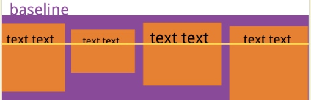

# 资料

[阮一峰flex参考资料](http://www.ruanyifeng.com/blog/2015/07/flex-grammar.html)

# flex-direction
**元素排列的方向**（主轴的方向）

水平排列
- `row`
从左往右，水平

- `row-reverse`

垂直排列

- `column`

- `column-reverse`

# flex-wrap 
是否换行
- `flex-wrap: nowrap;`

默认 `flex-wrap: nowrap;` 长度不够的时候，会按内容给予宽度，以下实际设置了宽度为100的，但是由于宽度不够，平分了父元素的宽度

- `flex-wrap: wrap;`

- `wrap-reverse`

# justify-content

主轴对齐方式（单轴线属性）

- `flex-start`

- `flex-end`

- `center`

- `baseline`

没实验，用的阮一峰老师的图

-`stretch`
item 不设置高度会撑满

