# 资料

[阮一峰flex参考资料](http://www.ruanyifeng.com/blog/2015/07/flex-grammar.html)

# 总结

##容器属性
- flex-direction:主轴方向<br>
`row`  `row-reverse`  `column`  `column-reverse`
- flex-wrap: 换行<br>
  `nowrap`  `wrap`  `wrap-reverse`
  
- flex-flow: direction-wrap 缩写
- justify-content:主轴对齐方式<br>
`flex-start`  `flex-end`  `center`  `space-between`  `space-around`
- align-items: 交叉轴对齐方式<br>
`flex-start`  `flex-end`  `center`  `baseline`  `stretch`
- align-content:多根轴线的对齐方式，单个不起作用<br>
`flex-start`  `flex-end`  `center`  `space-between`  `space-around`

## 项目属性

- order:排列顺序，越小越靠前
- flex-grow:剩余空间放大比例 默认0，不放大
- flex-shrink:缩小比例，默认1:
- flex-basis:main-size 默认auto
- flex： grow-shrik-basis 缩写 auto（1，1，auto）none（0 0 auto）
- align-self：覆盖父元素的align-item，项目自定义 <br>
`auto`  `flex-start`  `flex-end`  `center`  `baseline`  `stretch`;

# flex-direction
**元素排列的方向**（主轴的方向）

水平排列
- `row`
从左往右，水平
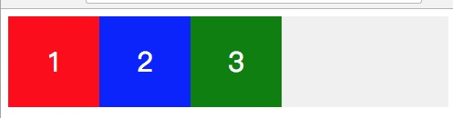

- `row-reverse`

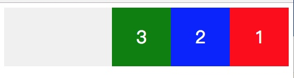

垂直排列

- `column`

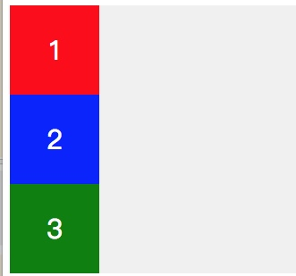

- `column-reverse`


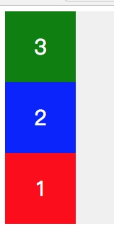

# flex-wrap 
是否换行
- `flex-wrap: nowrap;`

默认 `flex-wrap: nowrap;` 长度不够的时候，会按内容给予宽度，以下实际设置了宽度为100的，但是由于宽度不够，平分了父元素的宽度

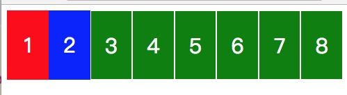

- `flex-wrap: wrap;`

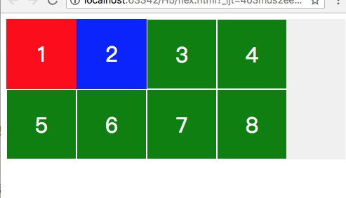

- `wrap-reverse`

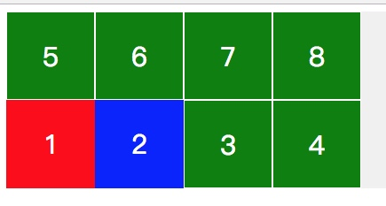


# justify-content

主轴对齐方式（单轴线属性）

- `flex-start`

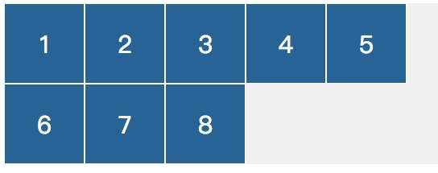

- `flex-end`

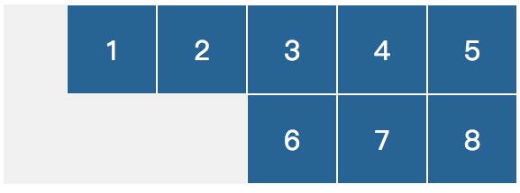

- `center`

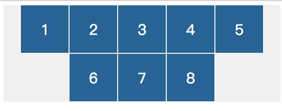

- `space-between`
主轴两端对齐，间距相等
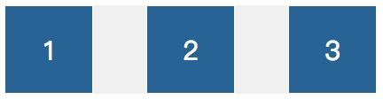

- `space-around`
> 元素之间的间距相等

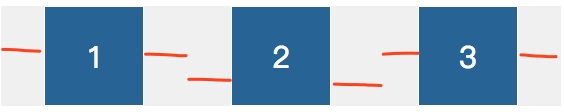

# align-items

- `flex-start`

交叉轴起点对齐
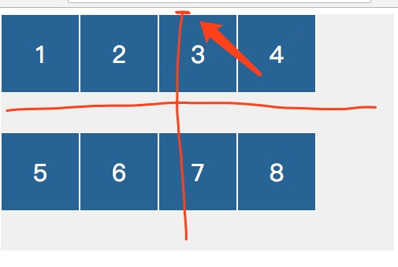


- `flex-end`

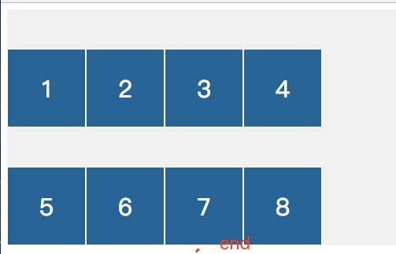


- `flex-center`

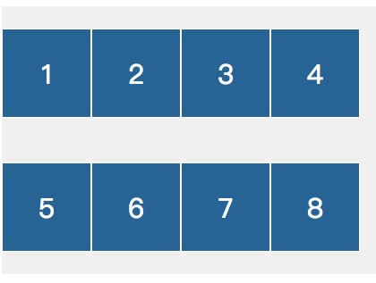


- `baseline`

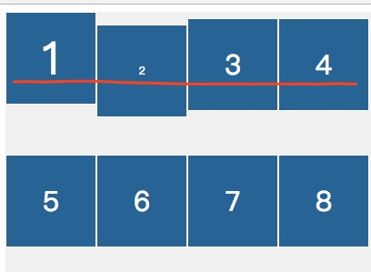


- `stretch`

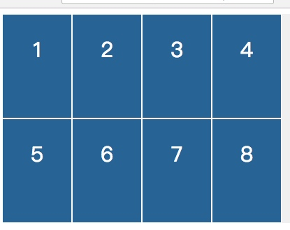


# align-conent
 
 把轴线当成元素，然后在交叉轴为参考线
 
 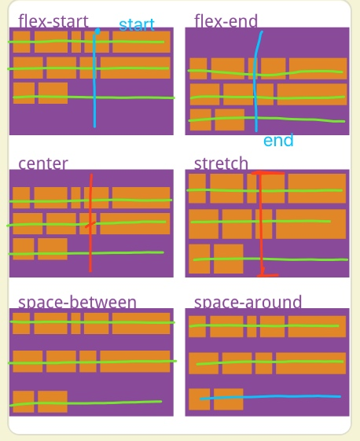

# 项目属性

##  order
> 定义项目的排列顺序，数值越小，排列越靠前，默认是0

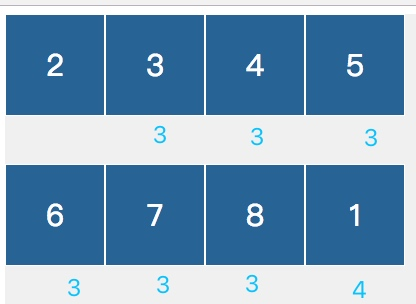

## flex-grow 
> 属性占剩余空间的放大比例 （父元素在主轴上太长了） 默认是0 不放大

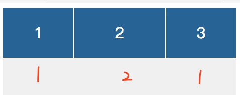

## flex-shrink
> 属性的缩小比例 （父元素在主轴上太小了） 默认是1 

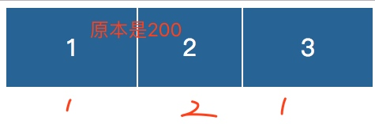

上图原本项目宽度是200px

## flex-basis
> 在定义分配空间之前，项目占据的主轴空间（main-size） 默认是auto，可以是数值，或者百分比

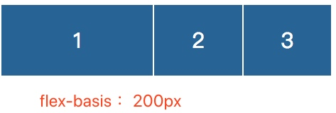

注意相当于定义了主轴上的width，优先级比flex-grow高

# flex
 `flex-grow` `flex-shrink`? || `flex-basis` 的

两个默认值 auto（1 1 auto）
none （0 0 auto）

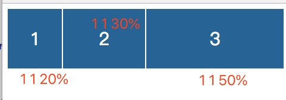

# align-self
> 单个项目覆盖align-items 属性 ，默认是
> auto 相当继承父元素的align-items，如果没有父元素等同于stretch


```css
.item {
  align-self: auto | flex-start | flex-end | center | baseline | stretch;
}
```

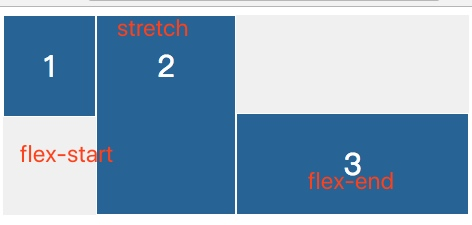


## 骰子实例

```css
<html lang="en">
<head>
    <meta charset="UTF-8">
    <title>Title</title>
    <style>
        .box {
            width: 120px;
            height: 120px;
            display: flex;
            background-color: whitesmoke;
            margin: 100px;
            border: 3px solid white;
            justify-content: space-between;
        }

        .item {
            width: 40px;
            height: 40px;
            background-color: black;
            border-radius: 20px;
        }

        body {
            background-color: black;
        }
    </style>
</head>
<body>
    <div class="box">
        <div class="item one"></div>
        <div class="item two"></div>
    </div>
</body>
</html>
```

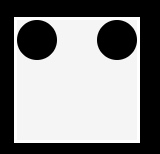

<hr>


```css
 flex-direction: column;
 justify-content: space-between;
```

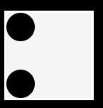

<hr>

```css
flex-direction: column;
justify-content: space-between;
align-items: center;
```


<hr>

```css
        .box {
            align-items: flex-end;
            justify-content: space-between;
        }

        .item:nth-child(1) {
            align-self: flex-start;
        }
```
//这个思路不好，应该box不用写align-items  第二个元素写align-self

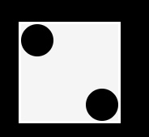

<hr>

```
        .item:nth-child(2) {
            align-self: center;
        }
        .item:nth-child(3) {
            align-self: flex-end;
        }

```

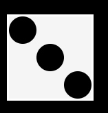

<hr>

```css
            flex-wrap: wrap;
            align-content: space-between;
            justify-content: flex-end;
```

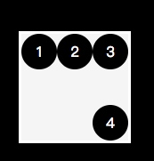

<hr>

```css
        .box {
            flex-wrap: wrap;
            align-content: space-between;
        }


        .column {
            flex-basis: 100%;
            display: flex;
            justify-content: space-between;
        }

```

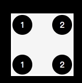
<hr>

```css
        .box {
            flex-wrap: wrap;
            align-content: space-between;
        }
```

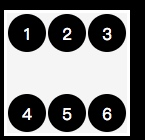

<hr>

```
   .box {
            flex-wrap: wrap;
            flex-direction: column;
            align-content: space-between;
        }
```

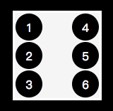


<hr>

```css
    <style>
        .box {
            flex-wrap: wrap;
        }


        .column {
            display: flex;
            flex-basis: 100%;
        }

        .column:nth-child(2) {
            justify-content: center;
        }

        .column:last-child {
            justify-content: space-between;
        }

    </style>
```

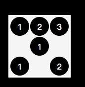

