# 元素种类

```
常用的块状元素有：

<div>、<p>、<h1>...<h6>、<ol>、<ul>、<dl>、<table>、<address>、<blockquote> 、<form>

常用的内联元素有：

<a>、<span>、<br>、<i>、<em>、<strong>、<label>、<q>、<var>、<cite>、<code>

常用的内联块状元素有：

、<input>
```

## 块级元素
- 每个块级元素都从新的一行开始，并且其后的元素也另外起一行
- 元素的高度、宽度、行号、以及顶和底部边距都可以设置
- 元素宽度不设置的为父元素的100%

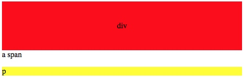

使用：**display: block** 可以是内联元素转为块元素

```css
a {
        display: block;
        background-color: #276879;
    }
```
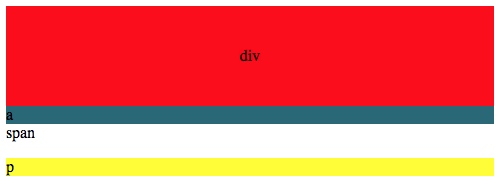

## 内联元素
- 和其他元素都在**一行**
- 元素的框度**宽高**以及顶部和底部边距都是**不可**设置的
- 元素的宽度就是它包含的文字和图片的宽度，不可改变

a、span、lable等都是内联元素（inline）行内元素。块装元素使用
**dispaly:inline** 转为行内元素
```css
 div {
            display: inline;
            /*行内元素宽高将不起作用*/
            width: 100px;
     }
```
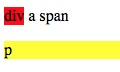

## 内联块状元素
- 和其他元素在**一行**上
- 元素的**宽高**、定底边距都**可以**设置


```css
       div {
            display: inline-block;
            width: 100px;
            height: 100px;
        }
```

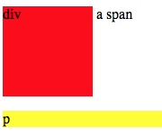


# 盒子模型

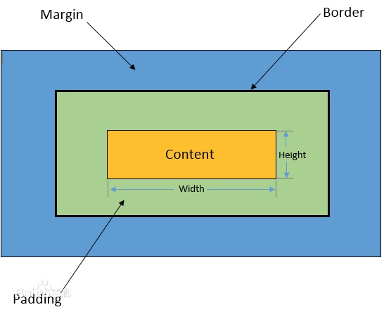

### 边框
边框的种类：dashed（虚线）、dotted（点线）、solid（实线），border-bottom（top，left，right）：可以单独设置

```
        body {
            border: 2px solid black;
        }
        div {
            display: inline-block;
            width: 100px;
            height: 100px;
            border: 1px solid blue;
        }
        p {
            boder-with:2px;
            border-style: dotted;
            border-color: #276879;

        }
```

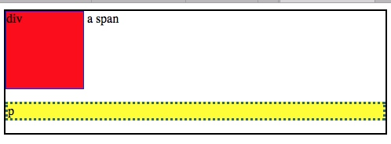

### 宽高
内容的宽高
```css
        div {
            display: inline-block;
            width: 100px;
            height: 100px;
            border: 1px solid blue;
            margin:10px;
            padding: 10px;
        }
```

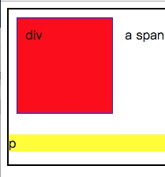

其盒子模型
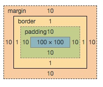

##  填充
按顺序是上右下左（顺时针）

```css
        div {
            display: inline-block;
            width: 100px;
            height: 100px;
            border: 1px solid blue;
            padding: 10px 15px 20px 30px;
        }
        
         /*可以分开写*/
        div {
            padding-top: 10px;
            padding-right: 15px;
            padding-bottom: 20px;
            padding-left: 30px;
        }
        
        div {
            /*上下10，左右15*/
            padding: 10px 15px;
        }
```

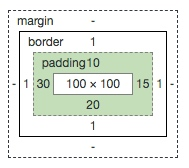


## 边界
```css
        div {
            display: inline-block;
            width: 100px;
            height: 100px;
            border: 1px solid blue;
            /*上下10，左右15*/
            padding: 10px 15px;
            margin:20px 10px 15px 30px;
        }
```
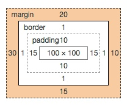


# CSS 布局模型
布局模型和盒模型是CSS最基础、最核心的概念。布局模型基于盒子模型

三种布局模型
- 流动模型（Flow）
- 浮动模型 （float）
- 层模型（Layer）

## 流动模型
Flow 是**默认**的网页布局。
- **块状元素**会在所处的包含元素**自上而下**按顺序垂直延伸排列，默认情况下块元素宽度为**100%**，块元素会以**行的形式**占据位置
- **内联元素**，在所处的包含元素内**从左到右**显示，不独占一行

## 浮动模型


```css
 .cbox {
            width: 100px;
            height: 100px;
            border: 1px solid red;
            float: left;
            margin-left: 90px;
        }
```

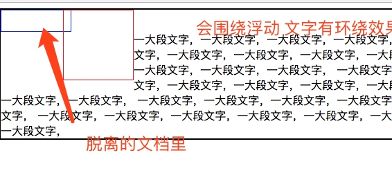


```css
<div style="clear: both;"></div>
```
可以清除浮动，又回到原来的文档流，占据浮动后的位置

## 层模型
可以对每个涂层，进行精确定位，有三种层模型
- 绝对定位 （position：absolute）
- 相对定位  （position：relative）
- 固定定位   （position：fixed）

### 绝对定位
设置**positon:absolute**,将其从作用的元素从文档流中拖出来，然后使用left,right,top,bottom，定位其**最近**一个**具有定位属性**的**父元素**块进行定位，如果不存在就是相对**浏览器窗口**

```html
<body>
    <div class="fbox">
        <div class="cbox">
            <span>box,box</span>
        </div>
        <span>span,span</span>
        <div style="width: 50px; height: 50px; border: 1px dotted black"></div>
    </div>
</body>
```

```css
    <style type="text/css">
        body {
            border: 2px solid black;
        }
        .cbox {
            width: 100px;
            height: 100px;
            border: 1px solid red;
        }
    </style>
```

其显示如图

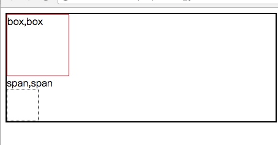

```css
 .cbox {
            width: 100px;
            height: 100px;
            border: 1px solid red;
            position: absolute;
        }
```

设置了**position: absolute;**之后会从文档流中脱离，原来的盒子相当于不在于原来的图层了

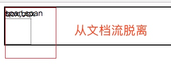

加上：
```css
   .cbox {
            position: absolute;
            left:70px;
            top: 30px;
        }
```

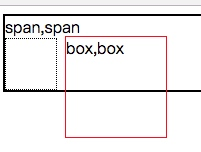

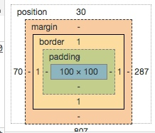

```css
        .fbox {
            position: absolute;
            border: solid green;
            left: 100px;
            top:50px;
        }
```

父元素，设置了定位属性后，子元素定位就相对于其父元素，同时其父元素也从文档流脱离

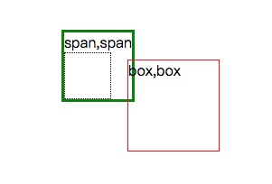

## 相对定位

需要设置positon:relative相对定位，通过设置left，right，top，bottom，确定在**正常的文档流中**的位置，首先按float方式生成一个元素（像浮动起来一样），相对于以前的位置进行偏移，**偏移前的位置保持不变**


```css
        .cbox {
            width: 100px;
            height: 100px;
            border: 1px solid red;
            position: relative;
            left:70px;
            top: 30px;
        }
```

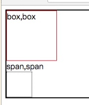
相对定位，其原来的盒子模型仍然占有原来的位置
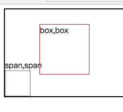

### 固定定位
fixed：表示固定定位，其相对移动的的坐标是**浏览器**，不虽滚动而移动。

```css
        .cbox {
            width: 100px;
            height: 100px;
            border: 1px solid red;
            position: fixed;
            right:10px;
            top: 30px;
        }
```

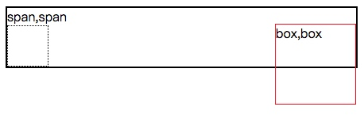
