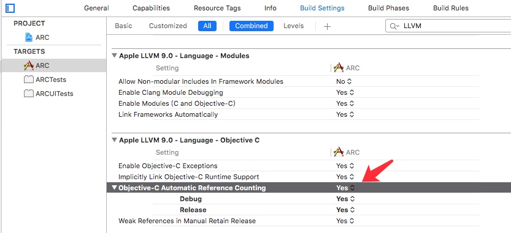
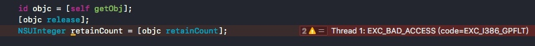
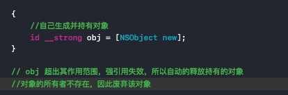

# ARC
> Automatic Reference Countting 指内存管理使用引用采用自动计数的技术，在LLVM中设置ARC有效的时候，就无需（禁止）使用retain或者release代码了

使用限制：
- Xcode 版本4.2及以上的版本
- LLVM编译器3.0及以上的版本
- 编译器选项设置ARC有效




## 内存管理的思考方式
- 自己生成的对象，自己持有
- 非自己生成的对象，自己也能持有
- 不再需要自己持有的对象时释放
- 非自己持有的对象不能释放


| 对象操作 | Object-C 方法 |
| --- | --- |
| 生成并持有对象 | alloc/new/copy/mutableCopy |
| 持有对象 | retain |
| 释放对象 | release |
| 废弃对象 | dealloc |

其中alloc等方法，符合驼峰命名的方式（CamelCase）的方式也是例如：
allocMyObject

非自己持有的对象不能释放



```objc
	{
		//自己生成的对象自己持有
		NSObject *obj  = [[NSObject alloc] init];
		//不在需要时，自己释放
		[obj release];
	}
	
	{
		//取的非自己生成的对象
		id array = [NSArray array];
		//可以持有，不自己生成的对象
		[array retain];
		[array release];
	}
```

### autorelease 
> 如同c语言的自动变量来对待对象实例，当超出其作用范围时，对象实例的release方法被调用


```objc
{
		//ARC无效
		NSAutoreleasePool *pool = [[NSAutoreleasePool alloc] init];
		id obj = [NSObject new];
		[obj autorelease];
		[pool drain];
	}
```

在RunLoop中每次循环会自动的生成和废弃NSAutoreleasePool对象

## 所有权修饰符
ARC 有效时，必须加上所有权修饰符。所有权一共有4种：

- __strong
- __weak
- __unsafe_unretained
- __autoreleasing

### __strong
> 对象类型的默认所有权修饰符，就是不添加修饰符默认会编译器会自动添加__strong修饰符



### __weak
 > 弱引用不持有对象，同时在持有某对象的弱引用的时候，若该对象被废弃，则弱引用将自动失效并且赋值为nil

## __unsafe_unretained
> __weak 只能兼容ios5以上版本，所有可使用__unsafe_unretained替换，不持有引用但是不安全，不会自动失效，赋值为nil

## __autoreleasing
> 替代autoRelease方法，变量作为函数返回值会自动注册到autoreleasepool中


```objc
	NSError __autoreleasing  *error = nil;
	NSError * __autoreleasing *pError = &error;
```

## Autorelease Pool 实现原理
> Autorelease Pool 是基于AutoreleasePoolPage以堆栈为结点的双向链表结构实现的，当push会在栈中push一个哨兵对象（边界对象）nil（0）, pop的时候，会给所有哨兵对象之后的对象调用release方法。在RunLoop开始的时候会调用AutoreleasePoolPage::push方法，在RunLoop循环即将结束的时候，调用pop方法。并且AutoreleasePoolPage和线程是一一对应的

参考资料：[雷纯峰-Objective-C Autorelease Pool 的实现原理](http://blog.leichunfeng.com/blog/2015/05/31/objective-c-autorelease-pool-implementation-principle/)


以下部分为NSobject.mm相关源码,删减了部分代码

```
class AutoreleasePoolPage 
{

#   define POOL_BOUNDARY nil //哨兵对象
    id *next;//指向下一个可以添加对象的位置
    pthread_t const thread;//对应的线程
    AutoreleasePoolPage * const parent;//父节点
    AutoreleasePoolPage *child;//子结点
    uint32_t const depth;//深度

    id * begin() {
        return (id *) ((uint8_t *)this+sizeof(*this));
    }

    id * end() {
        return (id *) ((uint8_t *)this+SIZE);
    }

    id *add(id obj) //添加对象到栈中
    {
        assert(!full());
        unprotect();
        id *ret = next;  // faster than `return next-1` because of aliasing
        *next++ = obj;
        protect();
        return ret;
    }


    void releaseUntil(id *stop)  //pop时候传入上次push的ctx哨兵对象
    {
        // Not recursive: we don't want to blow out the stack 
        // if a thread accumulates a stupendous amount of garbage
        
        while (this->next != stop) {
            // Restart from hotPage() every time, in case -release 
            // autoreleased more objects
            AutoreleasePoolPage *page = hotPage();

            // fixme I think this `while` can be `if`, but I can't prove it
            while (page->empty()) {
                page = page->parent;
                setHotPage(page);
            }

            page->unprotect();
            id obj = *--page->next;
            memset((void*)page->next, SCRIBBLE, sizeof(*page->next));
            page->protect();

            if (obj != POOL_BOUNDARY) {
                objc_release(obj);
            }
        }

        setHotPage(this);
    }

public:
    static inline id autorelease(id obj)
    {
        assert(obj);
        assert(!obj->isTaggedPointer());
        id *dest __unused = autoreleaseFast(obj);
        assert(!dest  ||  dest == EMPTY_POOL_PLACEHOLDER  ||  *dest == obj);
        return obj;
    }


    static inline void *push() 
    {
        id *dest;
        if (DebugPoolAllocation) {
            // Each autorelease pool starts on a new pool page.
            dest = autoreleaseNewPage(POOL_BOUNDARY);
        } else {
            dest = autoreleaseFast(POOL_BOUNDARY);
        }
        assert(dest == EMPTY_POOL_PLACEHOLDER || *dest == POOL_BOUNDARY);
        return dest;
    }

    
    static inline void pop(void *token) 
    {
        AutoreleasePoolPage *page;
        id *stop;

        if (token == (void*)EMPTY_POOL_PLACEHOLDER) {
            // Popping the top-level placeholder pool.
            if (hotPage()) {
                // Pool was used. Pop its contents normally.
                // Pool pages remain allocated for re-use as usual.
                pop(coldPage()->begin());
            } else {
                // Pool was never used. Clear the placeholder.
                setHotPage(nil);
            }
            return;
        }

        page = pageForPointer(token);
        stop = (id *)token;
        if (*stop != POOL_BOUNDARY) {
            if (stop == page->begin()  &&  !page->parent) {
                // Start of coldest page may correctly not be POOL_BOUNDARY:
                // 1. top-level pool is popped, leaving the cold page in place
                // 2. an object is autoreleased with no pool
            } else {
                // Error. For bincompat purposes this is not 
                // fatal in executables built with old SDKs.
                return badPop(token);
            }
        }

        if (PrintPoolHiwat) printHiwat();

        page->releaseUntil(stop); //发送release ***
        //.....
    }
};
```


