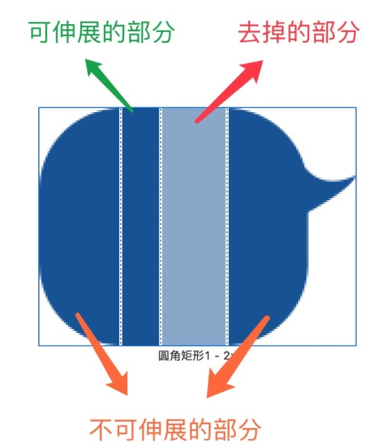
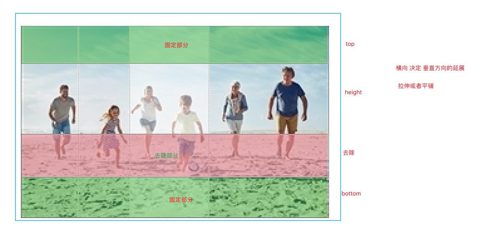
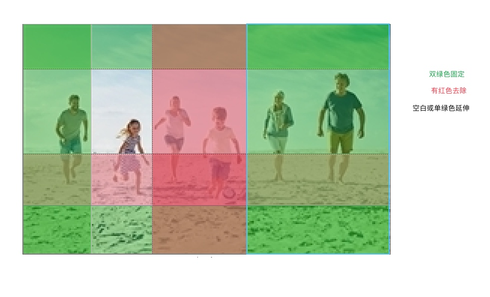
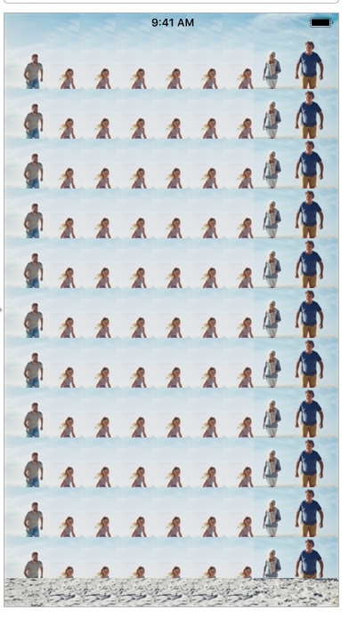

# UIImageRenderingMode
> 图片的渲染模式，只读属性，改变的需要使用`imageWithRenderingMode` 重新生成一张图片

```objc
    // Use the default rendering mode for the context where the image is used
    UIImageRenderingModeAutomatic,          
    // Always draw the original image, without treating it as a template
    UIImageRenderingModeAlwaysOriginal,  
    // Always draw the image as a template image, ignoring its color information   
    UIImageRenderingModeAlwaysTemplate,     
```

- UIImageRenderingModeAlwaysOriginal： 原图

- UIImageRenderingModeAlwaysTemplate：模版图片，会忽略其颜色使用，使用控件的tinColor 上色

- UIImageRenderingModeAutomatic : 自动根据上下文选择
  `navigation bars`, `tab bars`, `toolbars`, `segmented controls`
  的`foreground` images 会使用  `UIImageRenderingModeAlwaysTemplate`
  `background` images  谁使用  `UIImageRenderingModeAlwaysOriginal`

例如原图：


```objc
    UIImage *image = [UIImage imageNamed:@"Star"];
    self.imageView.tintColor = [UIColor yellowColor];
    self.imageView.image = [image imageWithRenderingMode:UIImageRenderingModeAlwaysTemplate];
```
渲染成：


# 图片的延伸（剪裁、.9、拉伸）
[参考资料](https://blog.csdn.net/zhongad007/article/details/78404232)




先看纵向延展



横纵都加


实际结果：


