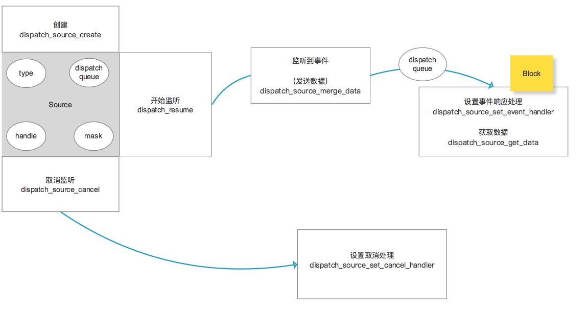

# Dispatch Sources

> 监视某些类型的事件，当事件发生时，它会自动的把一个block放到dispatch queue 中



## dispatch source

```objc
dispatch_source_t
dispatch_source_create(dispatch_source_type_t type,
	uintptr_t handle,
	unsigned long mask,
	dispatch_queue_t _Nullable queue);
```


| 参数 | 说明 |
| --- | --- |
| type | source类型 |
| handle | 句柄，索引，id 例如监听进程的进程id |
| mask | 描述，更详尽的描述 |
| queue | block执行队列 ======》处理响应句柄（block） |


## 定时器


```objc
- (void)timer {
    // Do any additional setup after loading the view, typically from a nib.
    dispatch_queue_t  queue = dispatch_get_global_queue(DISPATCH_QUEUE_PRIORITY_DEFAULT, 0);
    
    //创建想监听类型的源:时间类型
    dispatch_source_t timer = dispatch_source_create(DISPATCH_SOURCE_TYPE_TIMER, 0, 0, queue);
    _timer = timer;
    
    //设置源:timer
    dispatch_source_set_timer(timer, DISPATCH_TIME_NOW, 1ull * NSEC_PER_SEC, 0);
    
    //设置监听响应处理
    dispatch_source_set_event_handler(timer, ^{
        NSLog(@"%@",[NSDate date]);
    });
    
    //设置取消监听
    dispatch_source_set_cancel_handler(timer, ^{
        NSLog(@"计时器关闭了");
    });
    
    //开始
    dispatch_resume(timer);
    
    __weak typeof(self) weakSelf = self;
    dispatch_after(dispatch_time(DISPATCH_TIME_NOW, (int64_t)(10 * NSEC_PER_SEC)), dispatch_get_main_queue(), ^{
        if(!weakSelf) return;
        __strong typeof (weakSelf) strongself = weakSelf;
        if(!dispatch_source_testcancel(strongself->_timer)) { //检测源是否被取消
              dispatch_source_cancel(strongself->_timer);
        }
    });
    
}
```


## 用户事件


```objc
- (void)add {
    dispatch_source_t source = dispatch_source_create(DISPATCH_SOURCE_TYPE_DATA_ADD, 0, 0, dispatch_get_main_queue());
    _source = source;
    
    dispatch_source_set_event_handler(source, ^{
        unsigned long count = dispatch_source_get_data(source); //获取数据
        NSLog(@"%lu",count);
        if(count > 10) {
            dispatch_source_cancel(source);
        }
    });
    
    dispatch_source_set_cancel_handler(source, ^{
        NSLog(@"取消了");
    });
    
    dispatch_resume(source); //开始监听
}

- (void)touchesBegan:(NSSet<UITouch *> *)touches withEvent:(UIEvent *)event {
    static unsigned long count = 0;
    dispatch_source_merge_data(_source, ++count); //发送数据
}
```