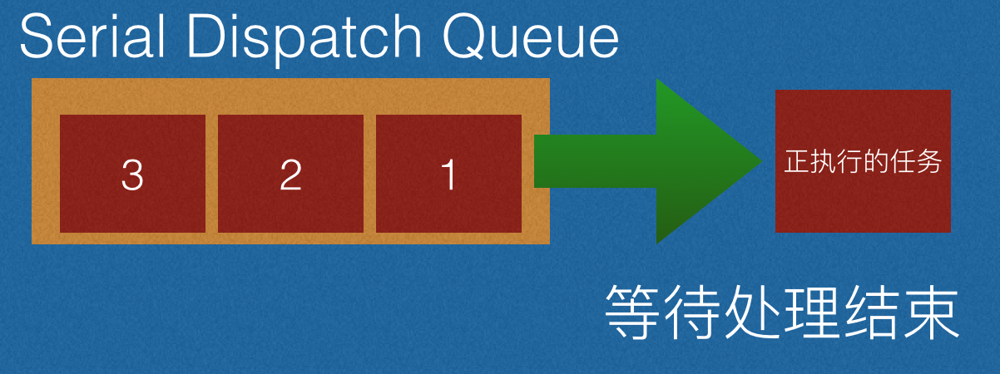
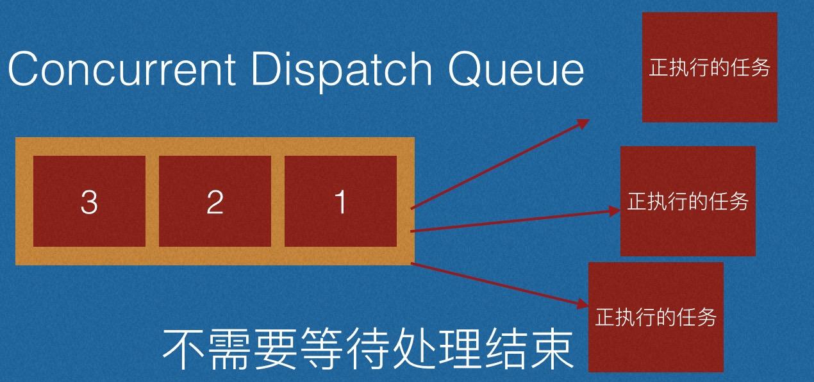
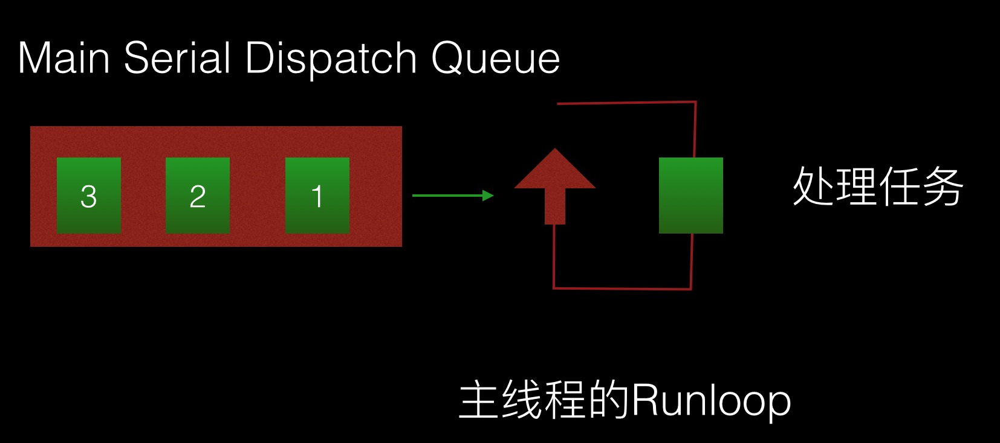

# GCD
Grand Central Dispatch

> dispatch 英 [dɪˈspætʃ] 派遣，调度;

是异步执行任务的技术之一。开发者只需要定义想执行的任务并追加到适当的Dispatch Queue 中，GCD
就能生成必要的线程并计划执行任务。


## 队列
用于存放任务，分为两种：**串行队列** 和 **并发队列**
对应GCD的 

```objc
dispatch_queue_t
```

|  队列|说明  | 
| --- | --- | 
| 串行Serial Dispatch Queue|需要等待执行任务结束，顺序执行<br>使用一个线程（取决于系统的状态） | 
| 并行Concurrent Dispatch Queue|不需要等待正在执行的任务结束，就会从队列中取出任务，在线程中执行<br>使用多个线程（取决于系统的状态） | 


### 串行队列
> 添加到串行的队列的任务，GCD会FIFO地按顺序取出，需要等待现在执行中任务处理结束。




### 并行队列
> 添加到并行队列的任务，GCD会多个同时执行，不要等待处理的任务结束




### 队列的创建
> concurrent: 英 [kənˈkʌrənt] adj.同时发生的;同时完成的;
> serial: 英 [ˈsɪəriəl] 连续的;顺序排列的;
> priority: 英 [praɪˈɒrəti] 优先，优先权;

- 主队列

> 追加到主线程中的任务会在主线程的Runloop中执行。libDispatch 会向主线程的Runloop发消息，Runloop会被唤醒，从消息中取出block
> 并在_CFRUNLOOP_IS_SERVICING_THE_MAIN_DISPATCH_QUEUE__()中执行





```objc
dispatch_queue_t main_queue = dispatch_get_main_queue();
```


- 全局并行队列


```objc
dispatch_queue_t queue = dispatch_get_global_queue(DISPATCH_QUEUE_PRIORITY_DEFAULT, 0);
```
对应的优先级

```objc
#define DISPATCH_QUEUE_PRIORITY_HIGH 2
#define DISPATCH_QUEUE_PRIORITY_DEFAULT 0
#define DISPATCH_QUEUE_PRIORITY_LOW (-2)
#define DISPATCH_QUEUE_PRIORITY_BACKGROUND INT16_MIN
```
- 用户队列

```objc
//对应的函数
//第一个参数表示为队列标示名称，可在Debug中区分队列，第二参数为队列的配置属性,例如并行还是串行
dispatch_queue_create(const char *_Nullable label,dispatch_queue_attr_t _Nullable attr);
		
// 使用
dispatch_queue_t queue = dispatch_queue_create("queue.name", DISPATCH_QUEUE_CONCURRENT);		
```

## 任务
表示要添加到队列的操作，在GCD中为Block

执行（调度派发）任务的方式有两种： 同步执行（sync）和异步执行（async）

### 同步执行 sync
> sync 英[sɪŋk] n.	同时，同步;

会**阻塞**当前线程，并**等待**Block中的任务执行完成完毕后，当前的线程才会继续执行

对应的函数：

```objc
void dispatch_sync(dispatch_queue_t queue, dispatch_block_t block);
```
第一个参数为执行队列，第二个参数为执行的block

### 异步执行
> async	英[ə'zɪŋk] adj.异步的

**不会阻塞**当前线程，**不用等待**会直接往下执行

对应的函数：

```objc
void dispatch_async(dispatch_queue_t queue, dispatch_block_t block);
```

## dispatch_after
> 在执行时间追加处理到 Dispatch Queue 中（注意不是指定后处理，任务还没有添加到队列中）
>


```objc
dispatch_time_t time = dispatch_time(DISPATCH_TIME_NOW, 1ull * NSEC_PER_SEC);
dispatch_after(time, dispatch_get_main_queue(), ^{
		......
});
```

第一个参数为 dispatch_time_t 可以使用 dispatch_time（相对时间） dispatch_walltime（决定时间）指定追加任务的时间 
第二个参数为指定追加任务的队列
第三个参数就是追加的任务

## Dispatch Group
> 可以给处理任务（block）分组，在属于该分组任务执行完成后可以使用dispatch_group_notify来做追加结束处理，也可以使用dispatch_group_wait获取属于该group的任务是否都执行完毕

常用于等待特定的并发处理后，需要执行后续处理
例如执行A B C D 4个任务都处理后，需要做额外的处理，可以使用Group实现。

Block 不是直接添加到FIFO队列，而是先加到Dispatch Continuation dispatch_continuation_t类型结构体中，用于记录block的group等执行上下文信息。dispatch_group_async 作用同dispatch_async ，只不过多标示了group属性。

dispatch_group_notify 是用于当属于group中的block全部执行完毕后，添加对应的block处理到对应的Dispatch Queue中

```objc
	dispatch_queue_t queue = dispatch_get_global_queue(DISPATCH_QUEUE_PRIORITY_DEFAULT, 0);
	dispatch_queue_t queue2 = dispatch_get_global_queue(DISPATCH_QUEUE_PRIORITY_DEFAULT, 0);
	dispatch_group_t group = dispatch_group_create();
	
	dispatch_group_async(group, queue, ^{
		sleep(rand()%10);
		NSLog(@"A done");
	});
	
	dispatch_group_async(group, queue2, ^{
		sleep(rand()%10);
		NSLog(@"B done");
	});
	
	dispatch_group_async(group, queue, ^{
		
		dispatch_group_enter(group);
		dispatch_async(queue2, ^{
			sleep(rand()%10+10);
			NSLog(@"C done");
			dispatch_group_leave(group);
		});
	});
	
	
	dispatch_group_enter(group);
	dispatch_async(queue2, ^{
		sleep(rand()%10+10);
		NSLog(@"D done");
		dispatch_group_leave(group);
	});
	
	dispatch_group_notify(group,dispatch_get_main_queue(), ^{
		NSLog(@"main: all done");
	});
	
	dispatch_group_notify(group,queue, ^{
		NSLog(@"queue: all done%@",[NSThread currentThread]);
	});
	
	dispatch_async(queue, ^{
		long result = dispatch_group_wait(group, dispatch_time(DISPATCH_TIME_NOW, 5ull * NSEC_PER_SEC));
		if( result == 0) {
			NSLog(@"属于group的处理在5秒后全部处理完成");
		}else {
			NSLog(@"属于group的处理在5秒后全部超时啦");
		}
	});
```

执行结果

```
2018-07-07 21:59:41.199855+0800 GCD[1599:54183] 属于group的处理在5秒后全部超时啦
2018-07-07 21:59:43.197756+0800 GCD[1599:54180] A done
2018-07-07 21:59:45.199051+0800 GCD[1599:54181] B done
2018-07-07 21:59:49.199317+0800 GCD[1599:54182] D done
2018-07-07 21:59:54.199108+0800 GCD[1599:54179] C done
2018-07-07 21:59:54.199559+0800 GCD[1599:54126] main: all done
2018-07-07 21:59:54.199668+0800 GCD[1599:54179] queue: all done<NSThread: 0x60c000273b40>{number = 3, name = (null)}

```

## dispatch_barrier_async
> 栅栏函数，常用于多读单写，需要用dispatch_queue_create来创建concurrent queue（不要是使用global queue）
使用dispatch_barrier_async 会等queue中的所有任务执行完毕后，并且只执行dispatch_barrier_async添加的处理，处理完毕后，后续的处理动作才会继续执行，如同一个栅栏。

```objc
dispatch_queue_t queue = dispatch_queue_create("my.concurrent.queue", DISPATCH_QUEUE_CONCURRENT);
	__block NSInteger num = 1;
	
	for(int i = 0; i < 2; i ++) {
		dispatch_async(queue, ^{
			NSLog(@"A-%d read: %lu", i, num);
		});
	}
	
	dispatch_async(queue, ^{
		NSLog(@"B 开始读");
		sleep(3);
		NSLog(@"B 读完了");
	});
	
	dispatch_barrier_async(queue, ^{
		NSLog(@"开始写");
		sleep(5);
		num = 2;
		NSLog(@"写完了");
	});
	
	for(int i = 0; i < 2; i ++) {
		dispatch_async(queue, ^{
			NSLog(@"C-%d read: %lu", i, num);
		});
	}
```

结果为：

```
2018-07-07 22:53:54.014983+0800 GCD[2560:98826] A-0 read: 1
2018-07-07 22:53:54.014985+0800 GCD[2560:98824] A-1 read: 1
2018-07-07 22:53:54.015005+0800 GCD[2560:98825] B 开始读
2018-07-07 22:53:57.020170+0800 GCD[2560:98825] B 读完了
2018-07-07 22:53:57.020607+0800 GCD[2560:98825] 开始写
2018-07-07 22:54:02.020898+0800 GCD[2560:98825] 写完了
2018-07-07 22:54:02.021107+0800 GCD[2560:98825] C-0 read: 2
2018-07-07 22:54:02.021112+0800 GCD[2560:98826] C-1 read: 2
```

## dispatch_apply
> 指定次数的追加block到队列中，并等待其全部执行结束

```
	dispatch_queue_t queue = dispatch_queue_create("my.concurrent.queue", DISPATCH_QUEUE_CONCURRENT);
	NSArray *nums = @[@1,@2,@3,@4];
	dispatch_async(queue, ^{
		NSLog(@"开始");
		dispatch_apply(nums.count, queue, ^(size_t index) {
			NSLog(@"%zu-%@",index,nums[index]);
		});
		NSLog(@"结束");
	});
	
2018-07-07 23:11:45.833193+0800 GCD[3011:111417] 开始
2018-07-07 23:11:45.833364+0800 GCD[3011:111417] 0-1
2018-07-07 23:11:45.833511+0800 GCD[3011:111417] 1-2
2018-07-07 23:11:45.833627+0800 GCD[3011:111417] 2-3
2018-07-07 23:11:45.833750+0800 GCD[3011:111417] 3-4
2018-07-07 23:11:45.833982+0800 GCD[3011:111417] 结束
```

## 队列的挂起和恢复

```
dispatch_suspend(queue);
dispatch_resume(queue);
```
## dispatch_once
> 常用于单例等，线程安全并且只执行一次的操作

```
static dispatch_once_t once;
dispatch_once(&once, ^{
	// 单次执行
});
```

##  dispatch_semaphore_t
> dispatch_semaphore_wait 当信号量大于0的时候，减一不等待，否则等待。
> 当做锁使用


```objc
	static dispatch_semaphore_t lock;
	static dispatch_once_t onceToken;
	dispatch_once(&onceToken, ^{
		lock = dispatch_semaphore_create(1);
	});
	
	dispatch_semaphore_wait(lock,DISPATCH_TIME_FOREVER);
	//.......
	dispatch_semaphore_signal(lock);
```


