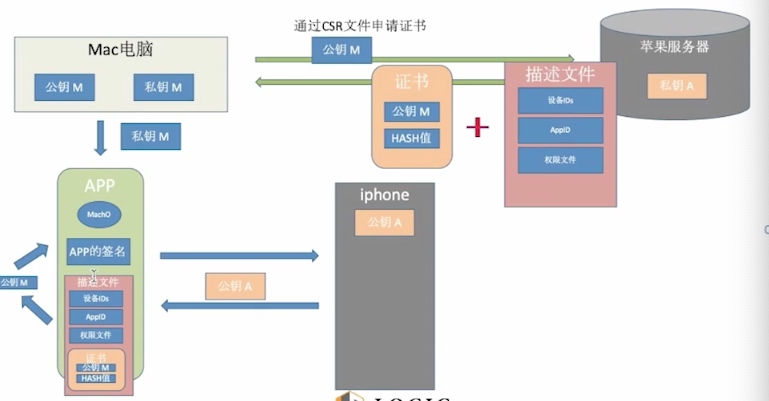

# base64

> 编码方案，不用来加密，但是加密后的数据可用base64表示

#HASH 散列函数
- MD5
https://www.cmd5.com/
结果一定，大量存储后可查询
加盐可防止被查询，盐写死会泄露（网站上可选出来）

- SHA1/512
- HMAC
使用key进行明文的加密，然后进行两次HASH
key一般由服务端给，每个账户对应一个
为一种加密方案

CommonCrypto.h ---->iOS

- 特点： 
算法公开
对相同的书加密，结果一致
对不同的数据加密，得到的结果定长的，如MD5 32个字符
不能反算
信息摘要，信息指纹

shell： md5  -s "xxxxxxx"

#对称加密算法（传统加密算法）
- 过程
 明文----> 加密（密钥key）----> 密文
 密文-----> 解密  ------> 明文
- DES
强度不高，被淘汰

- 3EDS
3个秘钥加密解密，使用起来麻烦

- AES（高级密码标准）

- 加密方式 
ECB：电子代码本，每个数据进行单独加密

CBC：密码块链，使用一个密钥 （有依赖关系）和一个初始化向量对数据进行加密
每一块加密都需要前面的数据做依赖，每一块数据的解密都依赖前一个数据

这种加密可以有效保证数据的完整性，数据的丢失会是加解密无效，用于防范窃听

openssl自带很多常用的加解密算法

块链方式
ecb：代码本加密 例如改一个字符，对应的加密结果一个段不同
cbc： 密码块链加密 改一个字符  后续加密结果都不同了

#非对称加密算法（RSA） 现代加密算法

##RSA openssl:

- genrsa 生产并输入一个RSA密钥
- rasutl 使用RSA密钥进行加密、解密、签名和验证运算
- rsa 处理RSA格式转换

- 生成RSA私钥
openssl genrsa -out private.pem 1024
1024比特位

内容长度比公钥长

- 从私钥中提取公钥
openssl rsa -in private.pem -pubout -out public.pem

- 通过公钥加密数据
openssl rsautl -encrypt -in message.txt -inkey public.pem -pubin  -out enc.txt

- 通过私钥解密
openssl rsautl -decrypt -in enc.txt -inkey private.pem -out dec.txt

公钥加密 ，私钥解密  私钥签名（加密） 公钥验证（解密）

##RSA特点
- 安全性高，加密解密使用不一样的密钥
- 运算的效率非常低，不适合大数据的加密

大数据加密的方案，一般使用对称加密，效率高

# 数字签名

- 数字信息的识别码

对数据进行HASH，然后 HASH 再进行RSA 加密 ，HASH之后，只有服务器能解密

数字签名：HASH  ---->  RSA

对原始数据进行一次对称加密，然后对加密后的数据进行一次RSA

服务端的使用私钥生产公钥，公钥直接给客户端（证书）

# iOS双向签名

MAC：
私钥M： p12
公钥M： CSR文件

CSR ---->苹果的私钥 进行签名(CSR->HASH)----> 证书
查看CSR信息
openssl asn1parse -i -in CertificateSigningRequest.certSigningRequest

打包App：
p12(私钥M)  ---》 App签名 +  证书 ----》 都打包到App中

验证：
证书解析----》公钥M -----》 App签名

# 描述文件
> 设备ID AppID 权限文件 解决滥用 数量等限制

- 限制苹果后台注册过的设备才可以安装
- 签名针对某一个具体的App

# iOS 应用重签名

ipa助手下载
ipa包 appSign.sh  yololib

codesign

-  查看App的签名信息
codesign -d -vv moonlanding.app
需要使用自己的证书，进行重签名

- 查看Mac中可以签名的证书
security find-identity -v -p codesigning

上传到AppStore的App 会被加密（加壳），加密的文件，CPU无法直接读取， 解密（砸壳）--》 读取到内存中
copy 中出来的

查看App中的可执行文件是否被加密
otool -l moonlanding.app/moonlanding > ~/Desktop/123.txt

 otool -l moonlanding.app/moonlanding | grep cryptid
两个值是因为，有两架构加密 

搜索： cryptid 不是布尔值 

 
 
0：表示没有加密
1：表示某种加密方式

