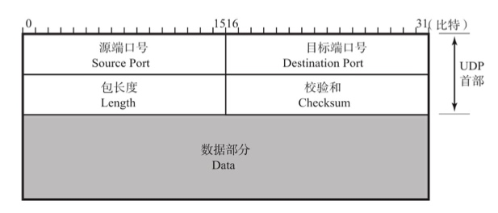
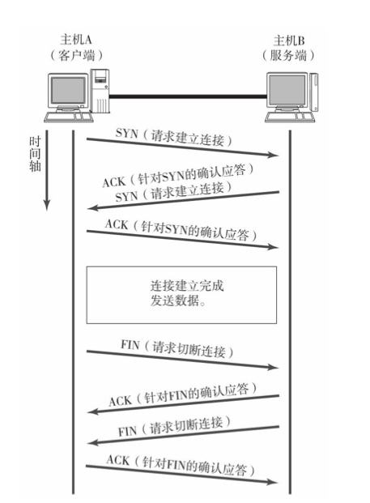
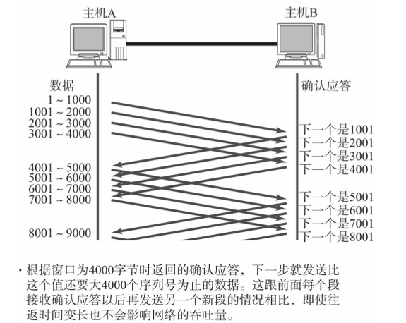
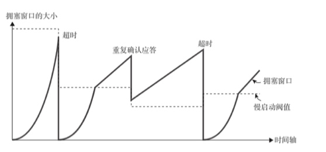
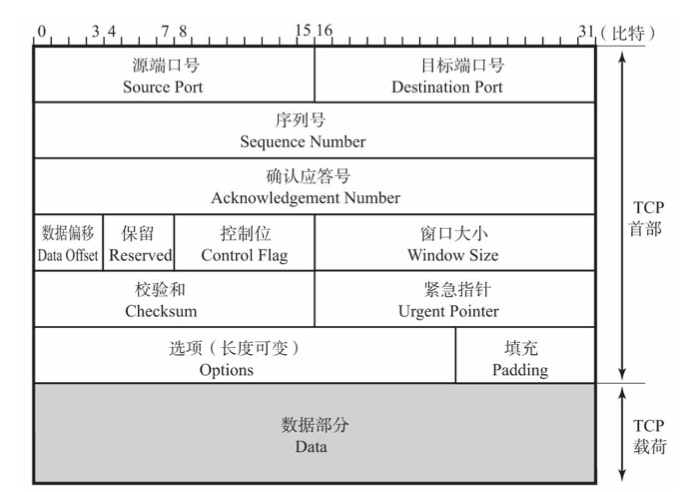
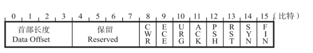

# 传输层的作用
> TCP/IP中两个代表性的传输协议：TCP、UDP。TCP提供可靠的传输协议，而UDP常用于广播或细节控制交给应用的通信传输
**IP**中有个一个协议字段，用来表示网络层上一层所采用的协议，根据这个字段，标示着
传输层的协议。
而传输层根据**端口号**识别上一层应用所要处理具体程序

> 连接： 指各种设备、线路、或网络中通信的两个程序为了相互传递消息而专有的、虚拟的通信线路，也叫虚拟电路

### TCP
TCP面向连接的、可靠的流协议。TCP提供可靠性传输，实现**顺序控制**和**重发控制**，此外还具备**流量控制**、**拥塞控制** 提高网络利用率等功能

### UDP
UDP是不具有可靠性的数据报协议，提供面向无连接的通信服务。主要用于高速传输和实时性要求高的通信或者广播通信。

- 包总量较少的通信 （DNS，SNMP）
- 音视频等多媒体通信
- 广播通信（广播、多播）
- 限定于LAN等特定网络的应用通信

## 端口

数据链路： MAC地址
IP： IP地址
传输层： 端口号（程序地址）

5元素： 
- 源IP地址
- 源端口号
- 协议号
- 目标IP地址
- 目标端口号

### 知名端口号
标准的既定端口号： 静态方法

HTTP，FTP等广为使用的应用协议中使用的端口号是固定的，这些端口号称为知名端口号。由0～1023数字分配。

时序分配法： 动态分配法
分配端口号，交由操作系统。端口号的取值范围为49152～65535

# TCP

TCP 通过校验和、序列号、确认应答、重发控制、连接管理、以及窗口控制等机制实现可靠性传输。

## 通过序列号和确认应答提高可靠性

数据到达接收主机时，接收端会返回一个已收到消息的通知。这个消息叫做确认应答
ACK（Positive Acknowled-gement，意指已经接收）

发送端将数据发出之后会等待对端的确认应答，如果有应答说明数据已经成功到达对端。
一定时间内没有等到确认应答，发送端会认为数据丢失，并重发。

### 序列号

确认应答、重发控制 以及重复控制都可以通过序列号实现。将发送的数据，每一个字节都标上号码编号。

接收端查询接受数据TCP首部中的序列号和数据的长度，将自己下一步应该接收的序号，作为
确认应答号返回回去。

## 连接管理

TCP 提供面向有连接的通信传输。一个连接的建立与断开至少需要发送7个包才能完成。
TCP连接需要发送3个包（三次握手），断开连接需要发送4个包（四次挥手）

## TCP 以段为单位发送数据

数据包的单位为最大消息长度MSS（Maximum Segment Size），MSS在三次握手的时候，计算得出。

### 窗口控制

TCP以一个段为单位，每次发送一个段进行一次确认应答处理，这种传输有个缺点。包的往返时间越长，通信性能越低。为了解决这个问题，引入窗口控制。确认应答不是以段为单位，而是以更大的单位，这样发送一个段之后，不必要等待确认应答，继续发送

TCP提供一种机制可以让发送端根据接收端实际接收能力控制发送的数据量：流控制。接收端向发送端发送窗口大小，发送端发送不超过其限制的数据。

 ## 拥塞控制
 
 TCP有了窗口控制，收发主机之间即使不再以一个数据端为单位发送确认应答，也能够连续发送大量数据包。然而通信开始的时候，就发送大量数据，会造成网络拥堵。为了解决这个问题，TCP采用**慢启动**算法，对发送的数据进行控制。
 
 

超时之后才会设置慢启动阀值，大小为拥塞窗口的一半。在到达慢启动阀之前以指数形增长，超过之后线形增长。

## 提高网络利用率

### Nagle算法
发送端即使有数据，但是这部分数据很少的话，会进行延迟发送。但可能会发送某种程度的延迟，一般会关闭

### 延迟确认应答

接收到数据后不立即返回确认应答，而是延迟一段时间。

### 捎带应答

TCP的确认应答和回执数据通过一个包发送（捎带），但前提是是延迟应答机制是开启的。

## TCP首部

- 源端口号：发送端端口号 16位
- 目标端口号：接收端端口号 16位
- 序列号SN：发送数据的位置，每发送一次数据，累加一次该数据的大小。不会从0，1开始而是在建立连接的生成随机数作为初始值。SYN，FIN不携带数据，但是会作为一个字节的增加对应的序列号
- 确认应答ACK：下一次应该接收的数据序列号。发送端会认为在这个序列号之前的数据都被正常接收了
- 数据偏移：表示数据部分从TCP包的哪个位开始计算，可以理解为TCP首部的长度。单位为4字节，TCP首部为20个字节，那么数据偏移为5（20/4），说明从开始到20字节为止为TCP首部。
- 控制位：从左至右为CWR、ECE、URG、ACK、PSH、RST、SYN、FIN

ECE：1 对方到这边的网络有拥塞
URG：1 紧急处理（例如按下Ctr+C关闭）
ACK：确认应答
PSH：立即传给上层协议
RST：异常断开连接
SYN：1希望建立连接，同时进行序列号的初始值设定
FIN：断开连接
