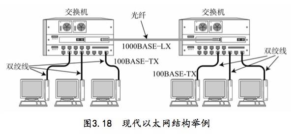

# 数据链路的作用

数据链路层的协议定义了通信媒介（电缆、光纤、红外线）互连的设备之间传输的规范。各个设备还会通过交换机、网桥、中继器等中转数据。
物理层：将电压高低、电波等与0、1进行转换，是物理层的责任。
链路层：将0、1序列集合成叫**帧**的块，再进行传输。

主要相关技术：
- MAC寻址
- 介质共享
- 分组交换
- 环路检测
- VLAN
- 以太网、WLAN、PPP

网络拓扑：网络的连接和构成形态

# MAC地址
由IEEE（美国电气和电子工程协会）制定规范,无论哪种数据链路的网络（以太网、FDDI、ATM、无线LAN、蓝牙等）都不会有相同的MAC出现

PS:网卡地址一般都会烧入ROM中

注意高低位顺序替换了。长度为48比特（6*8）
十六进制表示例如
00:10:5A:70:33:61

# 共享介质型网络
> 指多个设备共享一个通信介质,有两种介质访问控制方式：争用方式、令牌传递方式。基本采用半双工通信

## 争用方式
争夺数据传输的权力，也叫**CSMA（载波监听多路访问）**，网络中的各个站（节点）采用先到先得占用信道发送数据，如果多个站同时发送数据，会产生冲突现象。

改良的方式：**CSMA/CD**

会检查是否发生冲突，发生冲突会放弃发送数据，同时立即释放载波信道，延迟一段时间后再重新争用介质。

## 令牌传递方式

沿着令牌环法发送“令牌”报文，只有获得令牌的站才能发送数据。有两个特点
1. 不会有冲突
2. 每个站通过平等循环获得令牌的机会

# 非共享介质网络
> 网络中的每个站直连交换机，由交换机负责发送数据帧，发送端和接收端不共享通信介质，基本采用全双工通信方式，ATM，以太网采取的主流方式

## 半双工与全双工通信
半双工： 只发送**或**只接收的通信方式
全双工：同一时间既可以发送数据也可以接收数据。类似打电话

## 根据MAC地址转发
将集线器或集中器等设备以星型连接，就出现了新的网络设备：交换集线器。
将非介质共享型网络中所用的交换器再以太网中使用，也叫**以太网交换机**，以太网交换机有多个端口的网桥，根据每帧的目标MAC地址决定哪个端口发送数据，参考的表叫做转发表。

## 环路检测技术
数据帧在环路中持续转发，有两种方式解决：生成树、源路由
源路由法由IBM提出，判断发送数据的源地址是通过哪个网桥传输的，将帧写入RIF中

## VLAN

采用带有VLAN技术的网桥，不用实际修改网络布线，只需要修改网络的结构即可。VLAN可以过滤多余的包，提高网络承载效率
每个网段有个VLAN ID（VID）

# 以太网
是一种数据链路方式（以太：介质），在初期一般多个终端使用同轴电缆共享介质型连接，现在一般采用终端与交换机之间独占电缆的方式实现以太网

## 以太网帧

前导码：有01交替，末尾叫做SFD（值11），在这域之后为以太网帧的本体。

帧尾叫做FCS（Frame Check Sequence）4个字节。在VLAN中，会追加VLAN ID等数据

细分为：介质访问控制层（MAC）和逻辑链路控制层（LLC）
