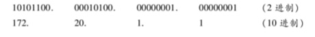
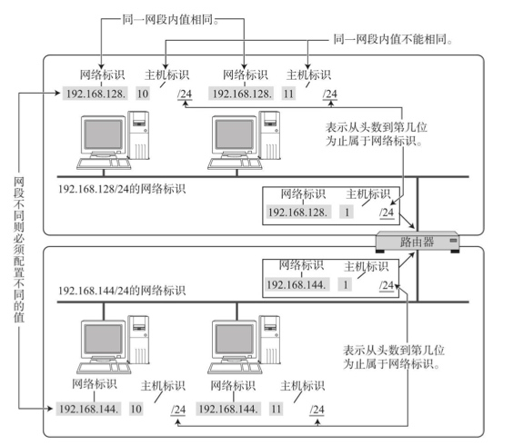
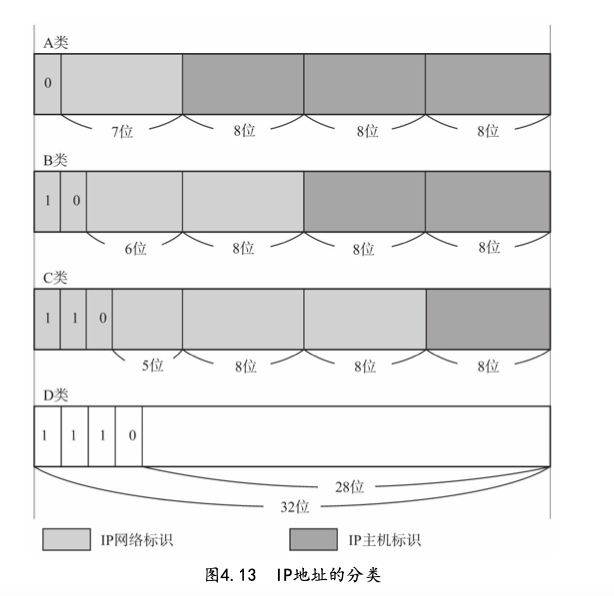

# 网络层的作用
> 主要作用实现终端节点之间的通信，“点对点通信”。数据链路层的主要作用是互连的同一种数据链路节点之间进行包传递，一旦跨越多种数据链路就需要借助网络层。

- 主机: 配有IP地址，但是不进行路由控制（转发分组包）
- 节点： 主机和路由的统称

## 与数据链路层的关系
数据链路是提供直连两个设备之间的通信，网络层提供两个没有直连网络之间的通信传输，依赖于链路层“区间内”链路传输。

## IP协议

> 主要负责将数据包发送给目标计算机，主要分为三大作用模块：IP寻址、路由、IP分包和组包

通信对端，必须有一个类似地址的标示码，数据链路中MAC地址表示同一链路中的不同设备，IP地址的用于在连接到网络中的所有节点中识别出进行通信的地址。IP地址不会因为数据链路层的改变而改变，网络层对数据链路层的特性进行了抽象（透明化，当作看不见）。

网桥、交换集线器，或数据链路层转发设别，不需要设置IP地址，这些设备只负责IP包转化为1、0或者对数据链路帧进行转发。

## 路由控制
> 将分组数据发送最终目的地址

- Hop：“跳”，利用数据链路分层功能传输功能传输数据帧的一个区间。IP路由也叫做多跳路由

如何知道路径？

IP包被转发到某个路由是，实际是转入数据链路层的数据帧，目标MAC地址就是下一个路由的地址，到了下一个路由之后，根据**路由表**再决定发往哪个路由

### 分片

不同数据链路的MTU不同，需要将较大的IP包分成较小的IP包。到达目的地址以后，被组合传给上一层。IP是属于面向**无连接**的：1.为了简化 2:为了提速，IP提供**尽力服务**

# IP地址
> IPv4: 由32位组成，常使用十进制点分发，每8位为一组，分成4组

## IP由网络和主机两部分组成
> IP地址由“网络地址”和“主机地址”两部分组成。192.168.128.10/24中1-24位为网络地址。

## IP地址分类
> IP地址分为A、B、C、D（E未使用），主机标识全为1为广播地址，全为0为网络地址，不用于分配给主机

- A类
1-8位标示网络地址，首位为0: 0.0.0.0～127.0.0.0

- B类
1-16为标示网络地址，首位为10：128.0.0.1～191.255.0.0

- C类
1-24为标示网络地址，首位为110：192.168.0.0～ 239.255.255.0

- D类
1-32为标示网络地址，首位为1110”：224.0.0.0～ 239.255.255.255

D类没有主机标识，常用于多播

## 广播地址
广播地址用于同一个链路中相互连接的主机之间发送数据包，将主机地址全部设为1，就是广播地址

>广播的IP包以数据链路的帧的形式发送，通过MAC地址全为1比特的 `FF：FF：FF：FF：FF：FF`转发。

`172.20.0.0/16`
`10101100.00010100.00000000.00000000`　的广播地址

`10101100.00010100.11111111.11111111`
`172.20.255.255`

广播分为：本地广播和直接广播
本地广播，为同一个网段中广播，不同链路中广播为直接广播。
由于直播广播存在安全问题，一般会被屏蔽。

## 多播
多播用于包发送给特定组内的所有主机，广播无法穿透路由，而多播可以穿透路由，在不同的网段中发送数据包。使用生存时间TTL限制包到达的范围

从224.0.0.0到239.255.255.255都是多播地址的可用范围。其中从 224.0.0.0到224.0.0.255的范围不需要路由控制，在同一个链路内也能实 现多播

