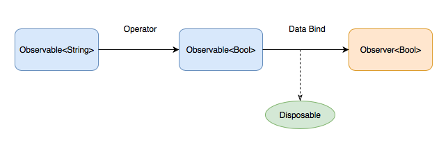
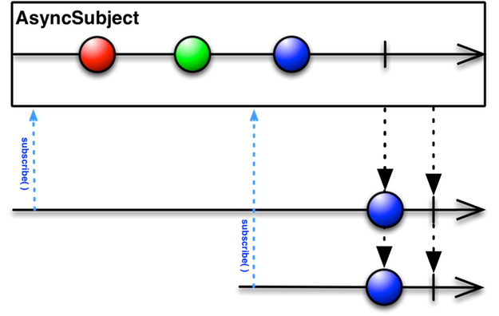
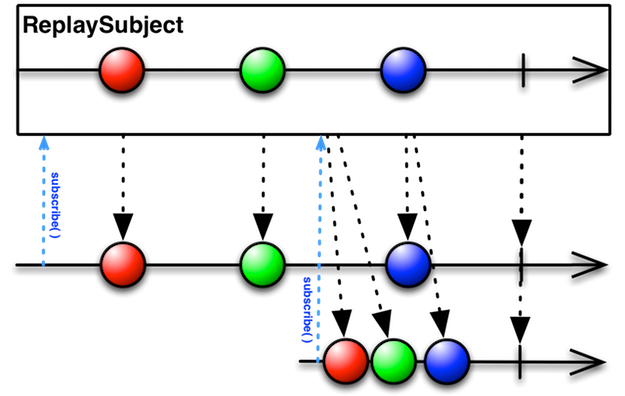
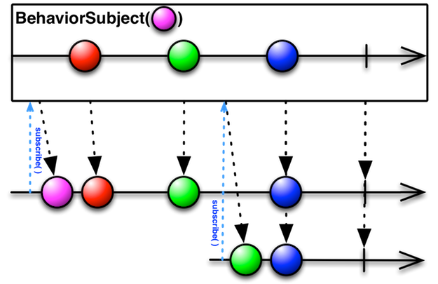

[Hangge适合入门](http://www.hangge.com/blog/cache/category_72_8.html)
# 核心


- Observable 产生事件序列
- Observer 响应事件 （观察者）
- Operator 创建变化组合事件
- Dispoable 管理绑定、订阅的生命周期
- Schedulers 线程队列调配

# Observable 

用于描述异步产生的序列，可被监听的序列

### Event

```swift
/// Represents a sequence event.
///
/// Sequence grammar: 
/// **next\* (error | completed)**
public enum Event<Element> {
    /// Next element is produced.
    case next(Element)

    /// Sequence terminated with an error.
    case error(Swift.Error)

    /// Sequence completed successfully.
    case completed
}
```

## 特征序列
Single Completable Maybe

```swift
        //特征序列
        //Single: 只能发出一个元素，或者一个error事件 例如HTTP
        Single<[String: Any]>.create { single in
            single(.error(SomeError.SomeWrong))
//            single(SingleEvent.success(["XXX":"XXX"]))
            return Disposables.create()
        }
        //Completable： 只能产生一个complted事件，要么产生一个error事件： 关心任务是否完成，而不在意返回值
        Completable.create { (completable) -> Disposable in
            completable(CompletableEvent.completed)
//            completable(CompletableEvent.error(SomeError.SomeWrong))
            return Disposables.create {
                //....
            }
        }
        /*
         Maybe: 只能发出一个元素，或者completed事件，或者一个error事件
         */
        Maybe<Int>.create { (maybe) -> Disposable in
            maybe(MaybeEvent.completed)
            maybe(MaybeEvent.error(SomeError.SomeWrong))
            maybe(MaybeEvent.success(1))
            return Disposables.create {
                //....
            }
        }
```
# Observer
观察者用来监听事件，创建观察者最直接的方法就是 Observable 的subscribe的订阅
以下是两个特征观察者

```swift
  /*
         AnyObserver: 可以描述任意一种观察者
        */
        
        /*
         init(eventHandler: @escaping EventHandler)
         EventHandler = (Event<Element>) -> Void
         */
        let ob = AnyObserver<String> { (event) in
            switch event {
            case .next(let string):
                print(string)
            case .error(let error):
                print("\(error)")
            case .completed:
                print("completed")
            }
        }
        
        /*
         Binder：
         不会处理错误事件
         确保绑定都在Scheduler上执行：（默认是MainScheduler）
         */
        /*
         _ target: Target, scheduler: ImmediateSchedulerType = MainScheduler(), binding: @escaping (Target, Value) -> ()
         */
        let binder: Binder<Bool> = Binder(self.nameText) { (v, isHidden) in
            //....
            v.isHidden = isHidden
        }
        
        nameValid.bind(to: binder).disposed(by: disposeBag)
```

# Observable & Observer

既是可被监听的序列也是观察者
例如textField的文本，可表示用户输入的产生的文本序列，也可以由外部文本序列
控制显示内容

## AsyncSubject
> 只发出最后一个元素，可以只是完成事件，或者error事件



```swift
        let subject = AsyncSubject<String>()
        
        //作为观察者，可以处理序列
        subject.subscribe { (event) in
            print(event)
        }.disposed(by: disposeBag)
       
        //作为序列可以发出事件序列
        subject.onNext("🌛")
        subject.onNext("🌞")
        subject.onNext("✨") //最后一个元素
        subject.onCompleted()
        /*
         next(✨)
         completed
         */
```

## PublishSubject


PublishSubject 对观察者发送订阅后产生的元素，不发送订阅之前的元素

```swift
       let subject = PublishSubject<String>()
        subject.onNext("🌛")
        subject.subscribe { (event) in
            print(event)
            }.disposed(by: disposeBag)
        subject.onNext("🌞")
        
         //next(🌞)
```

## ReplaySubject



将对观察者发出全部（n：缓存大小的）元素，无论什么时候订阅

```swift
        let subject = ReplaySubject<String>.create(bufferSize: 2)
        subject.onNext("😡")
        subject.onNext("😢")
        subject.onNext("😊")
        subject.subscribe { (event) in
            print(event)
            }.disposed(by: disposeBag)
        subject.onNext("🌧️")
        
        
        /*
         bufferSize: 2
         next(😢)
         next(😊)
         
         subscribe
         next(🌧️)
         */
```

## BehaviorSubject


当观察者订阅的时候，都会发出最新的元素，如果不存在，发出默认元素

```swift
        let subject = BehaviorSubject(value: "🌛")
        
        subject.subscribe { (event) in
            print(event)
            }.disposed(by: disposeBag)
        
        subject.onNext("😢")
        subject.onNext("😊")
        
        subject.subscribe { (event) in
            print("2" + event.debugDescription)
            }.disposed(by: disposeBag)
        
        subject.onNext("🌧️")
        
        /*
         next(🌛)
         next(😢)
         next(😊)
         2next(😊)
         next(🌧️)
         2next(🌧️)
         */
```

###  Variable
> 推荐 BehaviorRelay 替换 Variable

    ```swift
        let v = Variable("1")
        v.asObservable().subscribe { (event) in
           print(event)
        }.disposed(by: disposeBag)
        
        v.value = "2"
```
