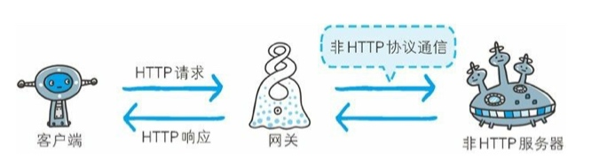

# 简单的Http协议

- `HTTP`协议用于客户端和服务端之间的通信
  必定有一端担任客户端角色，另一端担任服务端

- 是无状态的协议
  请求和响应都不做持久化处理
  HTTP/1.1 引入了Cookie技术保存状态
  
- URI `HTTP`使用URI定位资源

## HTTP方法

| 方法 | 说明 |
| --- | --- |
| GET | 用来请求访问已被URI识别的资源 |
| POST | 用来传输实体的主体 |
| PUT | 传输文件，但不带验证机制 |
| HEAD | 获取报文首部：确认URI的有效性及资源的更新的日期，不返回报文主体部分 |
| DELETE | 删除文件：用来删除文件，不带验证机制 |
| OPTIONS | 询问支持的方法 用来查询针对请求URI资源支持的方法 /1.1|
| TRACE | 追踪路径：让Web服务器将之前的请求通信环回地址给客户端 /1.1|
| CONNECT | 要求用隧道协议连接代理，主要使用SSL/TLS 1.1|

LINK/UNLINK 已经被HTTP/1.1废弃

## 持久连接

任意一端没有提出断开连接，则保持TCP连接状态，使用keep-alive 或 HTTP connection reuse 方法保持连接，HTTP/1.1 默认都是持久连接

## 管线化
不用等待亦可直接发送下一个请求，可以同时发送多个请求，而不需要等待响应

## Cookie 状态管理
响应报文Set-Cookie 通知客户端保存Cookie，下一次客户端发送请求
回加上Cookie的值

# HTTP信息
HTTP协议交互的信息被称为HTTP报文。
请求端：请求报文，
响应端：响应报文

## 结构

请求报文的结构：
1. 请求行
2. 请求首部字段、通用首部字段、实体首部字段
3. 报文主体

请求行： 请求方法，URI，HTTP版本

响应报文的结构：
1. 状态行
2. 响应首部字段、通用首部字段、实体首部字段
3. 报文主体

## 编码
实体主体通常就是报文主体，实体主体的内容会变化，例如编码

内容编码的方式：
- gzip
- compress
- deflate（zlib）
- identity （不编码）

## 分块传输编码
吧主体分块传输编码，接收端负责解码

## 发送多种数据的多部分对象集合
MIME Multipurpose Internet Mail Extensions
多用途因特网邮件扩展，会使用多对象集合（Multipart）

Content-Type： multipart/form-data；bounday=Aa09x

--Aa09x
Content-type：text/plain

boundary划分多部分对象集合指明的各类实体

## 获取部分内容的范围请求

Range： bytes=5000-10000

返回响应状态码为206 Partial Content，
Content-Type： multipart/byteranges

## 内容协商返回最合适的内容

- Accept
- Accept-Charset

# HTTP状态码

## 类别

| 码 | 类别 | 说明 |
| --- | --- | --- |
| 1XX | Informational 信息性状态码 | 请求正在处理 |
| 2XX | Success 成功状态码 | 请求正在处理完毕 |
| 3XX | Redirection 重定向状态码 | 需要进行附加操作以完成请求 |
| 4XX | Client Error 客户端错误状态码 | 服务端无法处理请求 |
| 5XX | Servier Error 服务器错误状态码 | 请求正在处理出错 |

## 2XX 成功

- 200 OK 正常处理
- 204 NO Content 请求成功，但是没有资源返回
- 206 Parital Content 部分内容

## 3XX 重定向

- 301 Moved Permanently
  永久性重定向，请求资源已被分配了新的URI
  
  - 302 Found
  临时性重定向，请求的资源已经分配了新的URI。
  不会保存书签
  
  - 303 See Other
  请求的资源存在着另一个URI，应该使用GET方法定向请求的资源
  
  301、302（禁止由POST改成GET，但实际大家都会这么做）
  
  - 304 Not Modified
  和重定向没有关系，客户端发送附带请求条件的请求（If-None-Match），
  但未满足条件
  
  - 307 Temporary Redirect
  和302相同，但是302禁止从POST改成GET，307会遵守浏览器的标准
  
 
## 4XX 客户端错误

- 400 Bad Requst
请求报文中存在错误

- 401 Unauthorize
请求需要BASIC等认证

- 403 Forbidden
服务端拒绝

- 404 Not Found

## 5XX 服务端错误  

- 500 Internal Server Error
服务端发生错误

- 503 Service Unavailable
服务端处于负载或者停机维护

# 与HTTP协作的Web服务器

- 代理
  代理服务器接收到客户端发送的请求的转化给其他服务器，不改变URI
  每次通过代理服务器会添加Via首部信息

- 网关
  
  

利用网关可以由HTTP请求转为其他协议通信

- 隧道  
  建议一条与其他服务器通信的线路，使用SSL等加密手段通信
  

# HTTP报文首部

 
 
  

  
  

